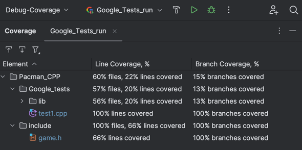

# 2D-game
This is the first draft of a simple 2D game using the SFML library.

## Installation Guideline
Clone the repository
```
git clone https://github.com/KTsula/Pacman_CPP.git
```

## Dependencies
This project depends on the [SFML library](https://www.sfml-dev.org/index.php). SFML can be installed via apt on Linux, brew on MacOS. For windows, you need to visit [SFML library](https://www.sfml-dev.org/index.php) and follow installation instructions.

## Compile and run
Once dependencies are set, you can compile the project with `cmake` in CLion and run it directly. Via command line you can ask `cmake` to generate the `Makefile` and then run `make all`

Mac/Linus - `g++ exec.c -lsfml-graphics -lsfml-window -lsfml-system`
Windows - `g++ main.c -o main -IC:/SFML-2.6.1/include -LC:/SFML-2.6.1/lib -lsfml-graphics -lsfml-window -lsfml-system`


## Making it work in Linux / Mac Environments

I just modified all the CMakes to work in such environments, so they should work if you just run 2D_game_assignment executable in CLion it should run smoothly!

As for the tests, you must run the executable Google_Tests_run in CLion, and it should work. Important to note, given the nature of SFML and the 2D game, you must play the game for a bit for all the tests to run! (I know, it's not ideal, but it's the best I could do)

Here you can see the coverage of our tests, and that they are all passing!


